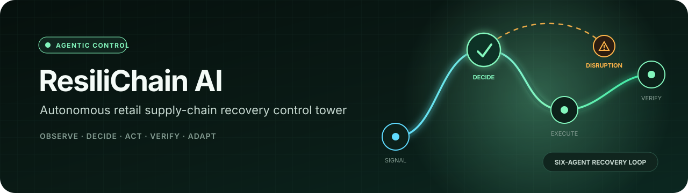
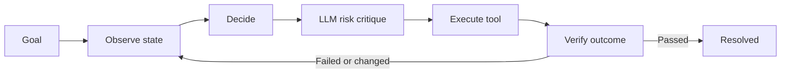
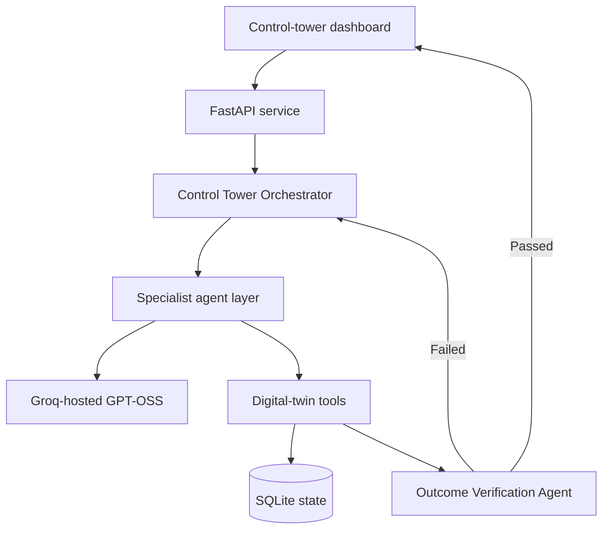

<p align="center">
  
</p>

<p align="center">
  <strong>A guarded six-agent system that detects supply-chain disruption, executes a recovery plan, verifies the result, and replans when reality changes.</strong>
</p>

<p align="center">
  <a href="https://github.com/Akarsh-42/resilichain-ai/actions/workflows/ci.yml"></a>
  
  
  
  
</p>

<p align="center">
  <a href="#quick-start">Quick start</a> ·
  <a href="#90-second-demo-script">Demo</a> ·
  <a href="#system-architecture">Architecture</a> ·
  <a href="#deployment">Deployment</a> ·
  <a href="docs/DEMO_AND_DEPLOY.md">Full guide</a>
</p>

> Built for the **Agentic AI Hackathon, Tech Zephyr 4.0 at IIT Bhubaneswar**. ResiliChain is not a chatbot or a single LLM wrapper: its agents inspect persistent state, choose tools, execute an action, evaluate the changed environment, and adapt after failure.

## The pitch in 30 seconds

Retail dashboards can report that a route failed, but people still have to reconcile inventory, delivery time, carrier availability, cost, and carbon limits before acting. ResiliChain AI turns that high-friction workflow into an auditable operating loop.

In the included scenario, flooding closes the east-port corridor. The agents select the best feasible west-road recovery, but the carrier fails during execution. The orchestrator observes the new state, excludes the failed route, replans through the south-express hub, updates the digital twin, and independently verifies the outcome.

| Demonstrated result | Verified value |
| --- | ---: |
| Inventory restored | **80 units** |
| Final recovery route | **south-express** |
| Delivery time | **23 hours** |
| Recovery cost | **₹2,200** |
| Carbon impact | **40 kg** |
| Execution attempts | **2** |
| Final verification | **5 / 5 checks passed** |

## Agentic workflow



Why this is genuinely agentic:

- **Goal-driven:** the orchestrator owns a measurable recovery objective and hard limits.
- **Dynamic decisions:** candidates are rebuilt from the latest digital-twin state.
- **Tool-using:** the selected route is executed against a stateful environment.
- **Adaptive:** a runtime carrier failure causes route exclusion and replanning.
- **Verifiable:** an independent agent re-queries the state and checks five conditions.
- **Robust:** model failure is clearly labeled and handled through a deterministic fallback.

## Six-agent system

| Agent | Responsibility | Evidence produced |
| --- | --- | --- |
| **Control Tower Orchestrator** | Owns the goal, delegates work, executes plans, and controls retries | Ordered run trace and state transitions |
| **Disruption Intelligence** | Observes closures, inventory, routes, vendors, and demand | Active disruptions and state revision |
| **Inventory & Sourcing** | Builds sourcing and allocation alternatives | Candidate routes with feasibility reasons |
| **Recovery Optimization** | Filters hard constraints and scores feasible plans | Selected plan, weighted score, rejected options |
| **LLM Risk Reasoning** | Critiques residual risk and recommends human review | Provider, model, `llm_used`, critique, fallback reason |
| **Outcome Verification** | Re-queries the twin after execution | Five pass/fail checks and final status |

The LLM can explain and critique a plan, but it **cannot override cost, SLA, inventory, capacity, or carbon constraints**.

## System architecture



### Current technology stack

| Layer | Technology | Purpose |
| --- | --- | --- |
| Interface | HTML, CSS, JavaScript | Premium operations control-tower dashboard |
| API | Python, FastAPI, Uvicorn | Scenario, configuration, health, and recovery endpoints |
| Agent runtime | Deterministic Python orchestration | Planning, tool execution, retries, and verification |
| LLM reasoning | Groq + `openai/gpt-oss-20b` | Bounded plan critique and residual-risk explanation |
| State | SQLite | Persistent digital-twin state and recovery events |
| Quality | Pytest + GitHub Actions | Adaptation, constraints, persistence, and LLM evidence tests |
| Hosting | Render or Cloudflare Quick Tunnel | Free public deployment or temporary demo sharing |

Planned production upgrades such as Supabase, n8n, and OR-Tools are documented in [`docs/ROADMAP.md`](docs/ROADMAP.md); they are not presented as completed integrations.

## Quick start

### Prerequisites

- Python **3.11 or newer**
- Git
- A free [Groq API key](https://console.groq.com/keys) for live LLM reasoning

The system runs safely without an API key, but the dashboard will honestly show **LLM FALLBACK** instead of **LIVE LLM**.

### Windows - easiest method

```powershell
git clone https://github.com/Akarsh-42/resilichain-ai.git
cd resilichain-ai
.\configure_llm.bat
.\start_demo.bat
```

The configuration helper creates `.env` and opens it in Notepad. Add your key after `GROQ_API_KEY=`, save the file, and restart the app if it was already running.

Open **http://127.0.0.1:8080** and confirm the top-right badge says `LIVE LLM · openai/gpt-oss-20b`.

### macOS / Linux

```bash
git clone https://github.com/Akarsh-42/resilichain-ai.git
cd resilichain-ai
cp .env.example .env
# Add your GROQ_API_KEY to .env
chmod +x start_demo.sh
./start_demo.sh
```

### Manual setup

```bash
python -m venv .venv

# macOS / Linux
source .venv/bin/activate

# Windows PowerShell
# .venv\Scripts\Activate.ps1

pip install -r requirements.txt
uvicorn backend.app.main:app --host 127.0.0.1 --port 8080
```

### Docker

```bash
docker compose up --build
```

Then visit **http://127.0.0.1:8080**.

## Environment configuration

Create `.env` from `.env.example`:

```dotenv
RESILICHAIN_DATABASE=resilichain.db
GROQ_API_KEY=your_key_here
LLM_MODEL=openai/gpt-oss-20b
LLM_TIMEOUT_SECONDS=10
```

Never commit `.env`, API keys, passwords, or deployment tokens. ChatGPT Plus and the OpenAI API are separate products; this project uses a Groq API key for its live reasoning agent.

## 90-second demo script

1. Open the dashboard and click **Reset scenario**.
2. Point out the east-port closure and the target: 80 units within 24 hours, ₹2,500, and 50 kg CO₂.
3. Confirm the header shows **LIVE LLM**.
4. Click **Run live recovery**.
5. Show that **west-road** is selected on attempt 1 and then fails during carrier execution.
6. Show the orchestrator replanning to **south-express** on attempt 2.
7. Open **Inspect evidence** in the LLM trace and show `llm_used: true`, the provider, and model ID.
8. Finish on the verification panel: **80 units restored** and **5 / 5 checks passed**.

Recommended narration:

> ResiliChain is a six-agent control tower, not a chatbot. Its agents observe persistent state, generate alternatives, enforce operational constraints, execute a tool, and verify the result. When the first carrier fails at runtime, the orchestrator observes the changed environment and replans to a new feasible route.

## Deployment

### Option A - Render

<p>
  <a href="https://render.com/deploy?repo=https://github.com/Akarsh-42/resilichain-ai">
    
  </a>
</p>

1. Connect this repository to Render.
2. Choose the free web-service plan.
3. Add `GROQ_API_KEY` as a secret environment variable.
4. Deploy the included `render.yaml` Blueprint.
5. Open the public URL a few minutes before judging because free services may sleep.

### Option B - temporary Cloudflare link

Keep the local server running, install `cloudflared`, and run:

```bash
cloudflared tunnel --url http://127.0.0.1:8080
```

Windows users can double-click `share_demo.bat`. The generated `trycloudflare.com` link works while the server, tunnel, and laptop remain online. It requires no domain or billing setup.

See [`docs/DEMO_AND_DEPLOY.md`](docs/DEMO_AND_DEPLOY.md) for the complete walkthrough and troubleshooting table.

## API reference

| Method | Endpoint | Purpose |
| --- | --- | --- |
| `GET` | `/api/health` | Service and LLM readiness |
| `GET` | `/api/config` | Public provider and model configuration |
| `GET` | `/api/scenarios/port-closure-001` | Current digital-twin state |
| `POST` | `/api/scenarios/port-closure-001/reset` | Restore the initial scenario |
| `POST` | `/api/scenarios/port-closure-001/recover` | Run the complete multi-agent recovery |
| `GET` | `/docs` | Interactive OpenAPI documentation |

## Tests

```bash
python -m pytest -q
```

The suite verifies:

- replanning after runtime failure;
- cost, delivery, carbon, inventory, and state-change constraints;
- persistent scenario state;
- honest LLM fallback behavior;
- live-model evidence fields.

## Repository structure

```text
resilichain-ai/
├── backend/app/       # API, digital twin, agents, orchestration, persistence
├── frontend/          # Control-tower dashboard
├── tests/             # Recovery, guardrail, persistence, and LLM tests
├── docs/              # Architecture, roadmap, demo, and collaboration guides
├── .github/workflows/ # Continuous integration
├── render.yaml        # Render Blueprint
├── Dockerfile
└── start_demo.*       # One-command local launchers
```

## Safety and design boundaries

- All recovery actions run inside a **synthetic digital twin**.
- The optimizer owns hard operational constraints; generated prose never bypasses them.
- LLM unavailability is visible in both the dashboard and trace evidence.
- No payment, purchase, or supplier commitment is made automatically.
- Production integrations should add authentication, approval gates, secret management, and observability.

## Documentation

| Document | Use it for |
| --- | --- |
| [`docs/PRODUCT.md`](docs/PRODUCT.md) | Problem, users, solution, and demo narrative |
| [`docs/ARCHITECTURE.md`](docs/ARCHITECTURE.md) | Agent roles and system design |
| [`docs/DEMO_AND_DEPLOY.md`](docs/DEMO_AND_DEPLOY.md) | Live demo, LLM setup, Render, Cloudflare, troubleshooting |
| [`docs/ROADMAP.md`](docs/ROADMAP.md) | Production expansion plan |
| [`docs/GITHUB_COLLABORATION.md`](docs/GITHUB_COLLABORATION.md) | Contributor workflow for the team |

---

<p align="center">
  <strong>ResiliChain AI</strong><br />
  From disruption alert to verified recovery.
</p>
