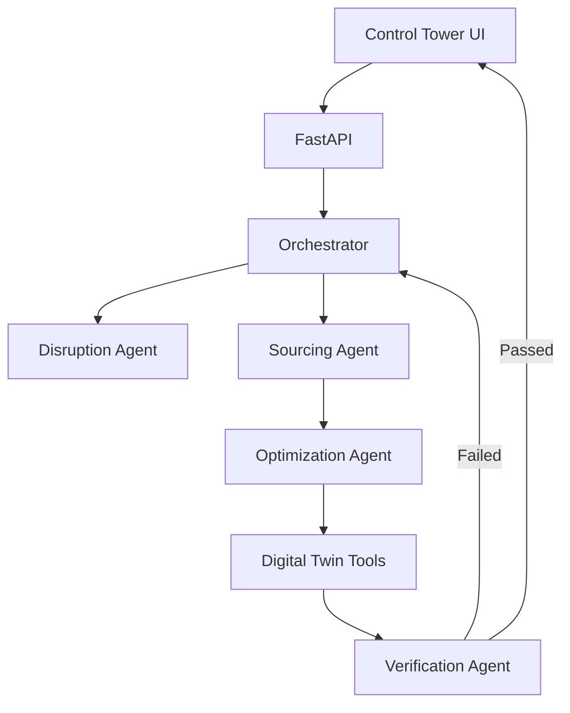

# ResiliChain AI architecture

## Agent responsibilities

1. **Control Tower Orchestrator** owns the goal, delegates work, executes the selected action, and replans after feedback.
2. **Disruption Intelligence Agent** observes route, shipment, inventory, vendor, and demand state.
3. **Inventory & Sourcing Agent** creates feasible sourcing and allocation candidates.
4. **Recovery Optimization Agent** compares candidates using deterministic cost, time, capacity, and carbon constraints.
5. **Outcome Verification Agent** independently re-queries the digital twin and verifies the state change.

The agents do not merely produce prose. They call observable tools, change simulated environment state, and use the resulting feedback to decide whether the goal has been achieved.

## Target production stack

- React/Next.js command-center frontend
- FastAPI service layer
- OpenAI Agents SDK orchestration and GPT models
- OR-Tools constraint optimization
- Supabase PostgreSQL, Auth, Storage, and Realtime
- Pub/Sub or n8n for disruption ingestion and outbound notifications
- Cloud Run deployment
- OpenTelemetry/Cloud Logging traces

The starter intentionally uses deterministic Python agents and SQLite so it runs without credentials. Model-backed reasoning and managed storage are introduced only after the behavior and tests are stable.
